# Business Flows

> Sequence diagrams + narrative cho các nghiệp vụ cốt lõi của CRM V4.
> Last verified: 2026-04-17.

## Table of Contents

1. [Lead Lifecycle — 3 Kho](#1-lead-lifecycle--3-kho)
2. [Payment Hybrid Verification](#2-payment-hybrid-verification)
3. [Auto-Recall (dept pool → floating)](#3-auto-recall)
4. [AI Lead Distribution](#4-ai-lead-distribution)
5. [Transfer (lead + customer)](#5-transfer)
6. [Call Log Ingest + Auto-Match](#6-call-log-ingest--auto-match)
7. [CSV Import (BullMQ)](#7-csv-import-bullmq)
8. [Task Reminder + Escalation](#8-task-reminder--escalation)

---

## 1. Lead Lifecycle — 3 Kho

### State Diagram

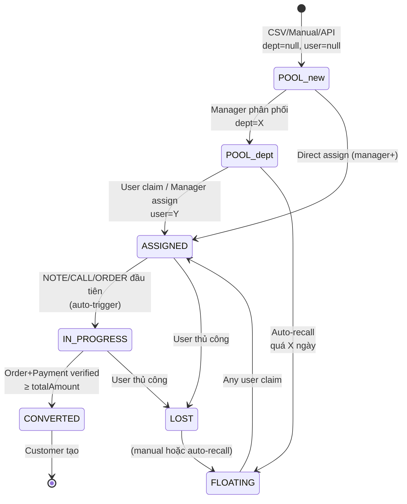

### Kho Model (derived state)

Kho KHÔNG phải cột riêng — derived từ 3 field:

| Kho | status | departmentId | assignedUserId | Ai thấy |
|-----|--------|--------------|----------------|---------|
| Kho Mới | POOL | **null** | null | MANAGER+ |
| Kho Phòng Ban | POOL | X | null | NV dept X + MANAGER X + SUPER_ADMIN |
| Kho Cá Nhân | ASSIGNED/IN_PROGRESS | X | Y | User Y + MANAGER X + SUPER_ADMIN |
| Kho Thả Nổi | **FLOATING** | (any) | (any/null) | **ALL users** |

### Sequence: User Claim từ Dept Pool

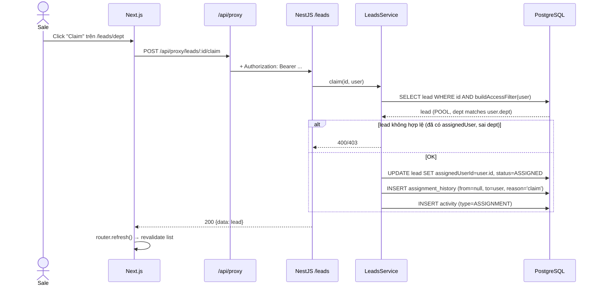

### Auto-Trigger IN_PROGRESS

Khi sale tạo **NOTE** hoặc **CALL** hoặc **ORDER** đầu tiên trên lead ASSIGNED:

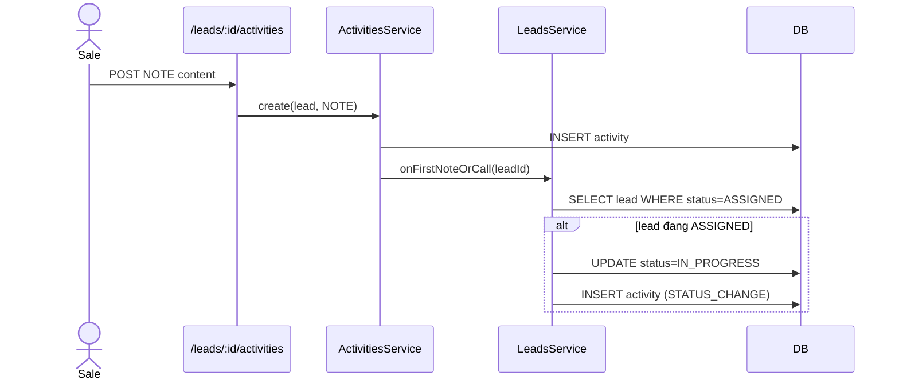

**Rule:** không downgrade từ IN_PROGRESS/CONVERTED về ASSIGNED.

---

## 2. Payment Hybrid Verification

3 nguồn verify: **sale tạo → webhook match**, **webhook đến → payment match**, **manager thủ công**, với **cron 2h** retry fuzzy.

### Flow A: Sale tạo trước, webhook đến sau

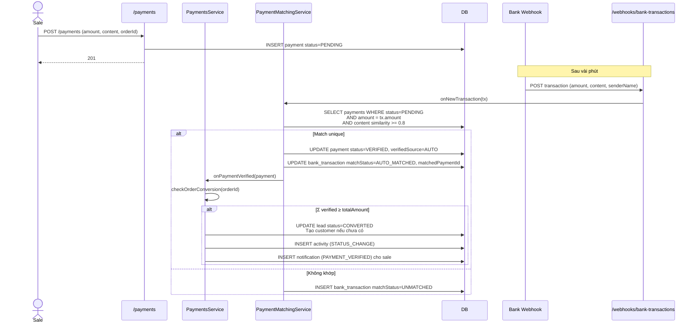

### Flow B: Webhook đến trước, sale tạo sau

Bank TX ingest với `UNMATCHED`. Khi sale tạo payment PENDING, `PaymentsService.create` gọi `Match.reverseMatch(payment)` để tìm TX UNMATCHED khớp → tự verify.

### Flow C: Cron fuzzy retry (mỗi 2h)

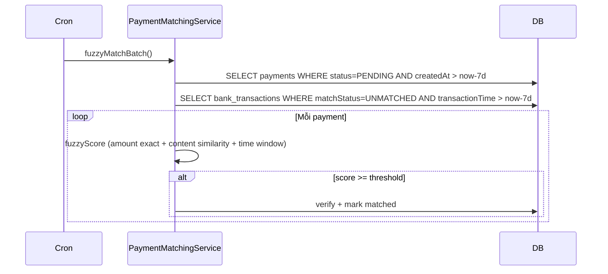

### Flow D: Manual verify (manager)

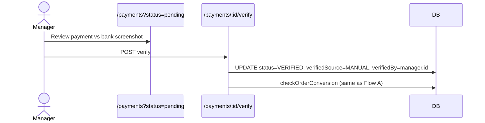

### Partial Payment Rule

- 1 order có thể có N payments (installment: CK lần 1/2/3/4/Full)
- Order KHÔNG chuyển CONVERTED từng lần, mà chỉ khi `SUM(VERIFIED payments) >= totalAmount`
- Lead CONVERTED đồng bộ theo order CONVERTED
- Refund/Cancel order sau CONVERTED **KHÔNG revert lead** (policy chính thức)

---

## 3. Auto-Recall

Cron **Daily 1 AM** quét lead/customer ở dept pool quá `maxDaysInPool` ngày → chuyển FLOATING + gắn labels mặc định.

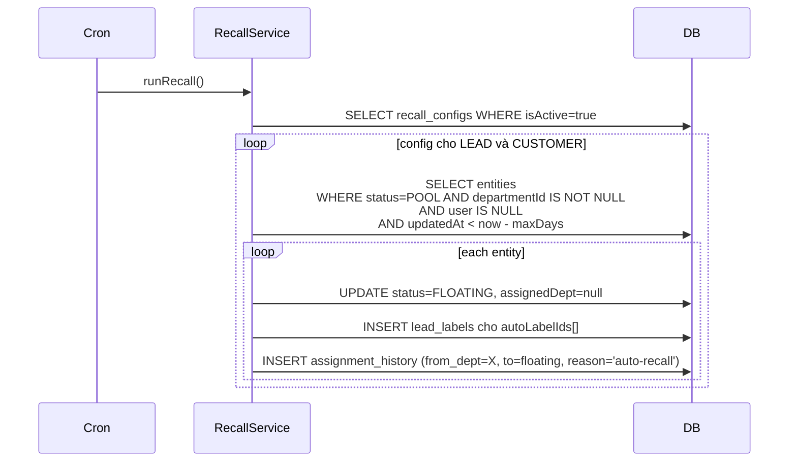

**Config per entity type:**
- LEAD: typical 14 ngày
- CUSTOMER: typical 30 ngày

Super admin toggle `isActive`, `/recall-configs/run-now` để trigger ngay (debug).

---

## 4. AI Lead Distribution

Khác với **assignment template** (round-robin giản đơn), AI Distribution dùng weighted scoring.

### Scoring Formula

```
score(user) = (workloadScore × 0.30)
            + (levelScore × 0.30)
            + (performanceScore × 0.40)

workloadScore    = 1 - (currentLeads / maxLeads)   # càng rảnh càng cao
levelScore       = user.level.rank / MAX_RANK
performanceScore = conversion_rate_30d * 0.6 + revenue_rank * 0.4
```

Weights config per dept qua `ai_distribution_configs.weightConfig` JSONB.

### Flow

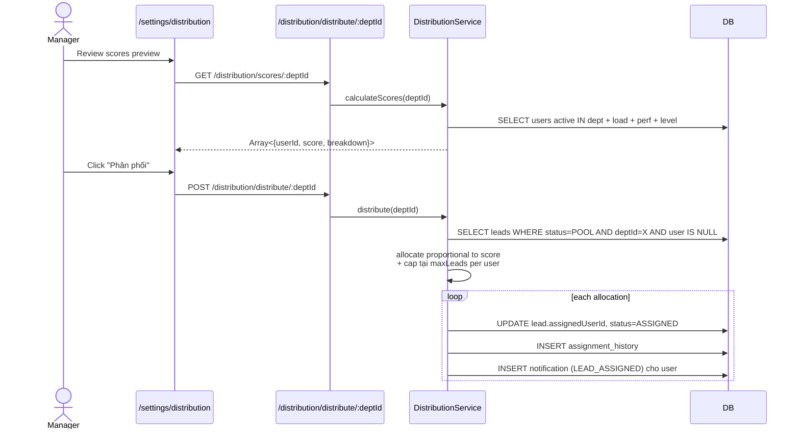

**Source skip_pool:** Lead từ source có `skipPool=true` (vd Zalo OA premium) đi thẳng vào distribution, bỏ qua kho phòng ban.

---

## 5. Transfer

### 3 Loại Transfer

| Loại | Target | Điều kiện |
|------|--------|-----------|
| DEPARTMENT | departmentId → Y | User hiện giữ + manager dept X + SUPER_ADMIN |
| FLOATING | status → FLOATING, user=null | Bất kỳ |
| UNASSIGN | user=null, status→POOL (giữ dept) | — |

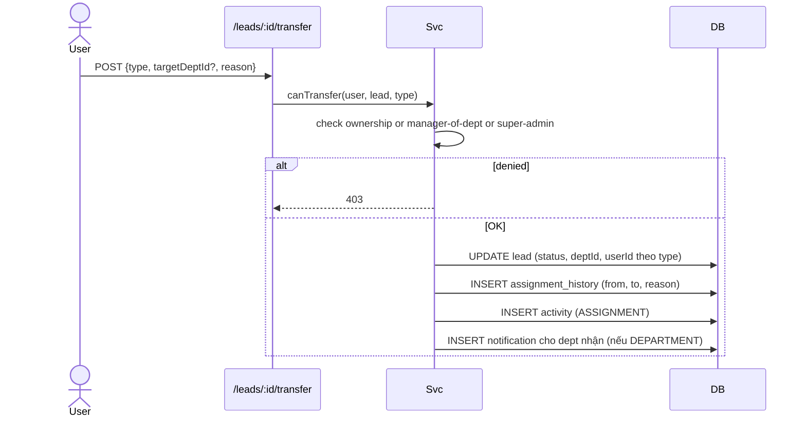

### User Deactivate

Khi SUPER_ADMIN deactivate user → leads của user tự về **dept pool** (giữ dept cũ). Auto-recall sẽ kick vào theo config bình thường.

---

## 6. Call Log Ingest + Auto-Match

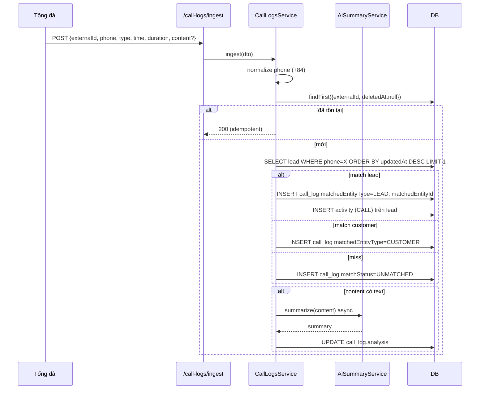

Manager có thể manual match qua `/call-logs/:id/match` cho row UNMATCHED.

---

## 7. CSV Import (BullMQ)

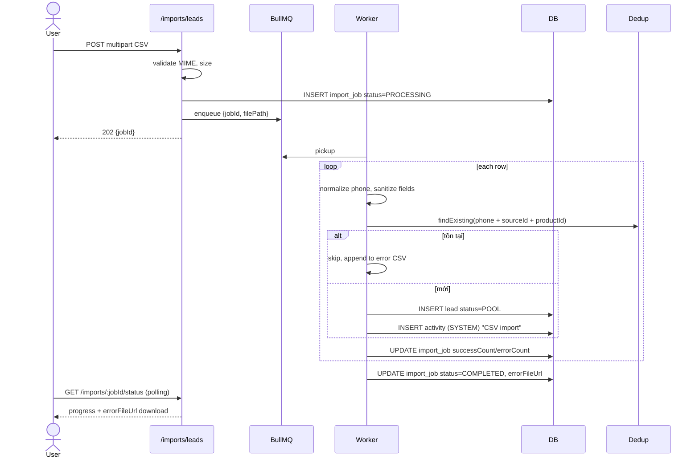

**Dedup rule:** CHỈ CSV import có dedup theo `phone + sourceId + productId`. Manual create hoặc API 3rd-party KHÔNG dedup (cho phép tạo trùng để xử lý nghiệp vụ riêng).

---

## 8. Task Reminder + Escalation

### 3 Cron

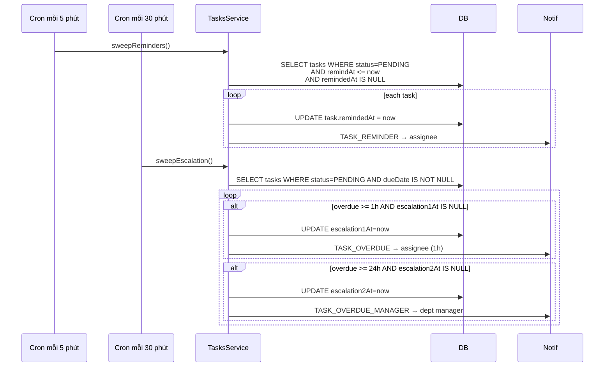

**Rule:** reminder chỉ gửi 1 lần (idempotent qua `remindedAt` flag). Escalation cũng 1 lần mỗi mốc.

---

## State Transitions Matrix

### LeadStatus

| From \ To | POOL | ZOOM | ASSIGNED | IN_PROGRESS | CONVERTED | LOST | FLOATING |
|-----------|:---:|:---:|:---:|:---:|:---:|:---:|:---:|
| (new) | ✅ | ✅* | — | — | — | — | — |
| POOL | — | — | ✅ | — | — | — | ✅ |
| ZOOM | — | — | ✅ | — | — | — | ✅ |
| ASSIGNED | — | — | — | ✅ | ✅** | ✅ | ✅ |
| IN_PROGRESS | — | — | — | — | ✅ | ✅ | ✅ |
| CONVERTED | — | — | — | — | — | — | — (terminal) |
| LOST | — | — | — | — | — | — | ✅ |
| FLOATING | — | — | ✅ | — | — | — | — |

\* ZOOM khi source.skipPool=true và nguồn là Zoom-related
\** Cho phép convert direct từ ASSIGNED nếu payment đầy đủ luôn

### CustomerStatus

| From \ To | ACTIVE | INACTIVE | FLOATING |
|-----------|:---:|:---:|:---:|
| (new) | ✅ | — | — |
| ACTIVE | — | ✅ | ✅ |
| INACTIVE | ✅ (reactivate) | — | ✅ |
| FLOATING | ✅ (claim) | — | — |

### OrderStatus

| From \ To | PENDING | CONFIRMED | COMPLETED | CANCELLED | REFUNDED |
|-----------|:---:|:---:|:---:|:---:|:---:|
| (new) | ✅ | — | — | — | — |
| PENDING | — | ✅ | — | ✅ | — |
| CONFIRMED | — | — | ✅ | ✅ | — |
| COMPLETED | — | — | — | — | ✅ |
| CANCELLED | ✅ | — | — | — | — |

### PaymentStatus

```
PENDING → VERIFIED (auto via webhook OR manual via manager)
PENDING → REJECTED (manual)
```

VERIFIED/REJECTED = terminal.

---

## Cross-Cutting Concerns

### Notification Triggers

| Sự kiện | Recipient | Type |
|---------|-----------|------|
| Lead assigned to user | user | LEAD_ASSIGNED |
| Lead transferred to dept | dept manager | LEAD_TRANSFERRED |
| User claim lead | dept manager (optional) | LEAD_CLAIMED |
| Payment verified | sale tạo payment | PAYMENT_VERIFIED |
| Task due soon | assignee | TASK_REMINDER |
| Task overdue 1h / 24h | assignee / manager | TASK_OVERDUE / _MANAGER |
| AI distribution run | users được assign | LEAD_ASSIGNED |
| Auto-recall trigger | (không notify — silent, có label) | — |

### Idempotency Points

- `call_logs.externalId` — ingest đi ingest lại không duplicate
- `bank_transactions.externalId` — webhook replay an toàn
- `task.remindedAt` — reminder chỉ gửi 1 lần
- `task.escalation1At/2At` — escalation 1 lần mỗi mốc

### Audit Trails

Mọi transfer/claim/assign/recall → INSERT `assignment_history`. Dùng cho:
- Employee scorecard (đếm leads assigned cho user trong khoảng time)
- Transfer audit report
- Investigation khi lead bị transfer nhiều lần

---

## Related Docs

- `data-model.md` — Schema chi tiết
- `api-reference.md` — Endpoint tương ứng mỗi flow
- `system-architecture.md` — Cron schedule + module dependencies
- `project-overview-pdr.md` — Business context & rules tổng quát
